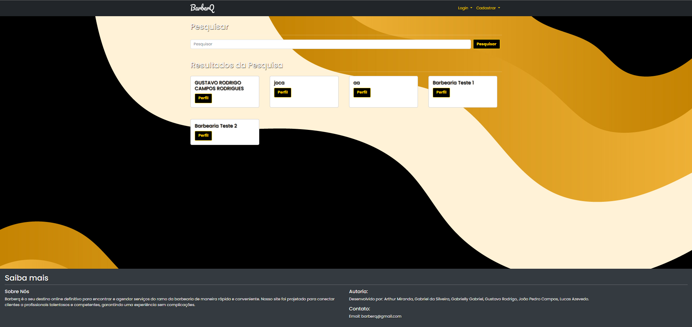

## 6. Interface do sistema

_Visão geral da interação do usuário por meio das telas do sistema. Apresente as principais interfaces da plataforma._

## 6.1. Tela principal do sistema

_tela principal do sistema._

## 6.2. Telas do processo 1

_Cadastro De Barbeiros_

_Aprovaçao de barbeiros_

## 6.3. Telas do processo 2

_Clicar para Cadastrar Serviço_

_Cadastro de Serviço_

_Aprovaçao do serviço por parte da Barbearia_

## 6.3. Telas do processo 3

_Seleçao de barbearia_

_Seleçao de Barbeiro_

_Agendar o serviço_

_Que Cria o Agendameto a confirmar_

_Confirmaçao de Agendamento do serviço Pela Barbearia_

_Recebimento da Atualizaçao do Status para o cliente e a Barbearia_

## 6.3. Telas do processo 4

_Cliente cancela Agendamento no seu perfil mostrado anteriormente e o status e mudado_

