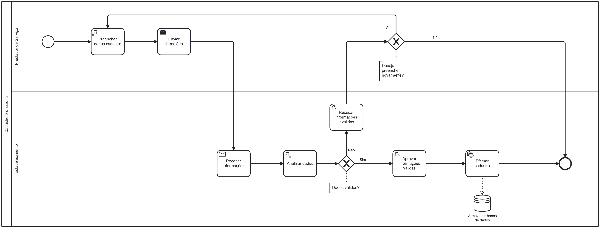

### 3.3.1 Processo 1 – Cadastrar Profissional

#### Oportunidades de Melhoria:

- Automação do processo de preenchimento de dados para reduzir erros manuais.
- Implementação de validações em tempo real para garantir a precisão das informações inseridas.
- Integração com sistemas externos para facilitar a busca e preenchimento automático de dados quando possível.
- Criação de um sistema de feedback para os clientes acompanharem o progresso do cadastro.

#### Detalhamento das atividades

**Preencher Dados de Cadastro**

| **Campo**       | **Tipo**         | **Restrições** | **Valor default** |
| ---             | ---              | ---            | ---               |
| Nome            | Caixa de Texto   | 3 Letras - Numeros - Caracteres especiais - Simbolo             |     N/A              |
| Email           | Caixa de Texto   | E-mail válido- Mínimo 1 ponto(.) e 1 (@)|    N/A            |
| Senha        | Caixa de Texto   | Mínimo 6 caracteres |      N/A             |
| Confirmar Senha        | Caixa de texto   | Senha devem ser iguais |           N/A        |
| Selecionar Barbearia | Caixa de listagem | Barbearia registrada no Banco de Dados | --- |

**Comandos**

| Comando | Destino                      | Tipo    |
| ------- | ---------------------------- | ------- |
| Cadastrar  | Enviar dados para o estabelecimento | default |

**Analisar Dados**

| **Campo**       | **Tipo**         | **Restrições** | **Valor default** |
| ---             | ---              | ---            | ---               |
| Check-box            | Check-box    | --- | --- |
| Usuário           | Área de texto   |---|    Usuário            |
| Email do Usuário        | Área de texto   | --- | Email do Usuário      |
| Status        | Área de texto   | Aprovado / Reprovado |           Pendente       |

**Comandos**

| Comando | Destino                      | Tipo    |
| ------- | ---------------------------- | ------- |
| Aprovar  | Enviar email de aprovação | default |
| Rejeitar        | Enviar email de rejeição   | default |
