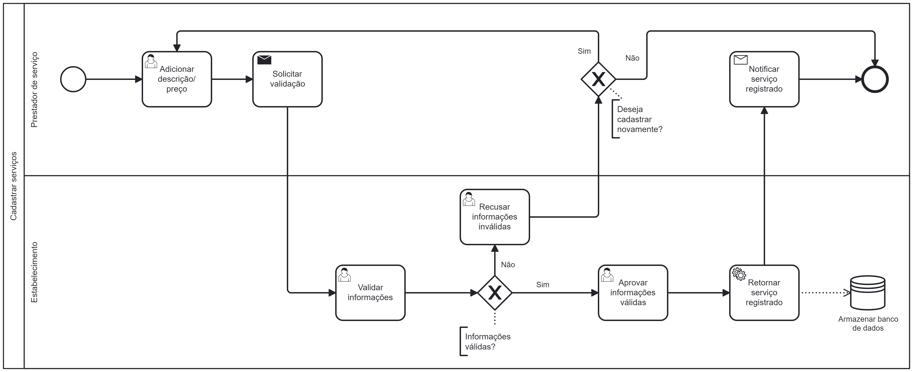

### 3.3.2 Processo 2 – Cadastrar Serviço

#### Detalhamento das atividades

**Adicionar descrição serviço**

| **Campo**             | **Tipo**           | **Restrições**          | **Valor default** |
| --------------------- | ------------------ | ------------------------| ----------------- |
| Descrição             | Caixa de Texto      | Mínimo de 3 caracteres |          Null         |
| Preço            | Caixa de Texto      | Valor fracionário |          Null         |

**Comandos**

| **Comandos**          | **Destino**                        | **Tipo**  |
| ----------------------| -----------------------------------| --------- |
| Enviar   | Enviar solisitações      | default   |

**Validar informações**

| **Campo**             | **Tipo**           | **Restrições**          | **Valor default** |
| --------------------- | ------------------ | ------------------------| ----------------- |
| Check-box            | Check-box | --- | --- |
| Descrição             | Area de Texto      | --- |          Descrição       |
| Preço            | Area de Texto      | --- |          Preço          |

**Comandos**

| Comando | Destino                      | Tipo    |
| ------- | ---------------------------- | ------- |
| Aprovar  | Enviar email de aprovação | default |
| Rejeitar        | Enviar email de rejeição   | default |
