### 3.3.3 Processo 3 – Marcar/Agendar Serviços

#### Detalhamento das atividades

**Nome da atividade 1: Selecionar barbearia**

| **Campo**       | **Tipo**          | **Restrições** | **Valor default** |
| ---             | ---               | ---            | ---               |
| Barbearia      | Seleção única    |    Um por vez            |     Nenhum              |

| **Comandos**         |  **Destino**                 | **Tipo** |
| ---                  | ---                          | ---      |
| Agendar          | Atividade 2  | default |

**Nome da atividade 2: Verificar serviço/ data/ horário/ contato/ profissional**

| **Campo**       | **Tipo**         | **Restrições** | **Valor default** |
| ---             | ---              | ---            | ---               |
| Serviço         | Área de texto   |                |                   |
| Data            | Data            |dd/mm/aa - Valores negativos - Data anterior      |     Local date    |
| Horário         | Hora            |dd/mm/aa - Valores negativos - Data anterior         |     Local time     |
|Profissionais    |Área de texto    |                |                    |

| **Comandos**         |  **Destino**                       | **Tipo** |
| ---                  | ---                                | ---      |
| Cancelar             | Início do processo | cancel   |

**Nome da atividade 3: Marcar como agendado**

| **Campo**       | **Tipo**         | **Restrições** | **Valor default** |
| ---             | ---              | ---            | ---               |
| Agendar         | Seleção única    |     ---          |          ---         |

| **Comandos**         |  **Destino**                    | **Tipo** |
| ---                  | ---                             | ---      |
| Agendar                  |  Perfil do usuário | default  |
