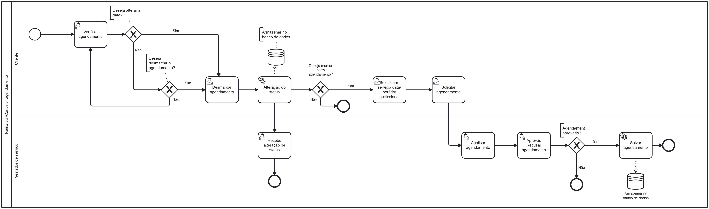

### 3.3.4 Processo 4 – Remarcar ou Cancelar Agendamento

#### Detalhamento das atividades

**Verificar barbearia selecionada**

| **Campo**       | **Tipo**         | **Restrições** | **Valor default** |
| ---             | ---              | ---            | ---               |
| Barbearia  | Área de texto |               |                   |

| **Comandos**         |  **Destino**                   | **Tipo** |
| ---                  | ---                            | ---               |

**Gateway - Deseja alterar a data?**

| **Campo**       | **Tipo**         | **Restrições** | **Valor default** |
| ---             | ---              | ---            | ---               |
| Deseja alterar a data? | Seleção única | Opções: sim, não |  |

| **Comandos**         |  **Destino**                   | **Tipo** |
| ---                  | ---                            | ---               |
| Sim                  | Verificar serviço/ data/ horário/ contato/ profissional     | default           |
| Não                  | Gateway - Deseja desmarcar o agendamento? | default           |

**Gateway - Deseja desmarcar agendamento?**

| **Campo**       | **Tipo**         | **Restrições** | **Valor default** |
| ---             | ---              | ---            | ---               |
| Deseja cancelar agendamento? | Seleção única | Opções: sim, não |  |

| **Comandos**         |  **Destino**                   | **Tipo** |
| ---                  | ---                            | ---               |
| Sim                  | Verificar serviço/ data/ horário/ contato/ profissional         | default           |
| Não                  | Atividade 1 | default |

Verificar serviço/ data/ horário/ contato/ profissional**

| **Campo**       | **Tipo**         | **Restrições** | **Valor default** |
| ---             | ---              | ---            | ---               |
| Serviço         | Área de texto   |                |                   |
| Data            | Data            |dd/mm/aa - Valores negativos - Data anterior      |     Local date    |
| Horário         | Hora            |dd/mm/aa - Valores negativos - Data anterior         |     Local time     |
|Profissionais    |Área de texto    |                |                    |

| **Comandos**         |  **Destino**                       | **Tipo** |
| ---                  | ---                                | ---      |
| Cancelar             | Início do processo | cancel   |

**Desmarcar agendamento**

| **Campo**       | **Tipo**         | **Restrições** | **Valor default** |
| ---             | ---              | ---            | ---               |
| Desmarcar         | Seleção única    |     ---          |          ---         |

| **Comandos**         |  **Destino**                    | **Tipo** |
| ---                  | ---                             | ---      |
| Desmarcar                  |  Fim do processo | default  |
