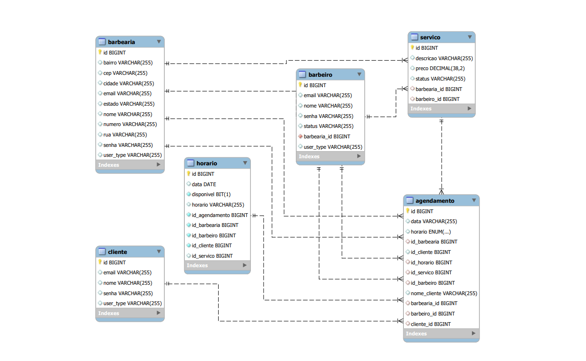

## 4. Projeto da solução

### 4.1. Modelo de dados

---

### 4.2. Tecnologias

| Ambiente  | Plataforma              |Link de Acesso |
|-----------|-------------------------|---------------|
|Repositório de código | GitHub | <https://github.com/ICEI-PUC-Minas-PPLES-TI/plf-es-2024-1-ti2-1381100-barberq> |
| Quadro Kanban | GitHub Projects | <https://github.com/orgs/ICEI-PUC-Minas-PPLES-TI/projects/341> |
| Editor de Código | Visual Studio Code | <https://code.visualstudio.com/> |
| Comunicação | WhatsApp e Discord| <...> |
| Diagramação | BPMN.IO | <https://bpmn.io/> |
| Hospedagem | ... | <...> |
| SGBD           | MySQL           |
| Front end      | HTML, CSS, JS     | <https://github.com/ICEI-PUC-Minas-PPLES-TI/plf-es-2024-1-ti2-1381100-barberq/tree/main/src/main/resources/static>
| Back end       | Java SpringBoot | <https://github.com/ICEI-PUC-Minas-PPLES-TI/plf-es-2024-1-ti2-1381100-barberq/tree/main/src/main/java/com/br/barberq/barberq>

